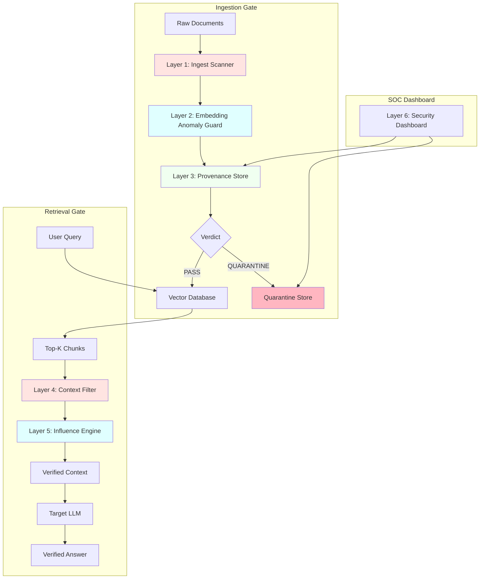

# 🛡️ Retrivance

A multi-layer security pipeline for detecting and mitigating malicious content in Retrieval-Augmented Generation (RAG) systems.

Retrivance is a security-focused RAG defense system designed to identify potentially malicious, poisoned, or adversarial content before it can influence downstream retrieval and generation. The system combines lexical detection, semantic similarity, classification, provenance/integrity checks, retrieval-time filtering, and counterfactual influence analysis to provide defense in depth against attacks targeting RAG knowledge bases.

---

## 🎯 Problem

Retrieval-Augmented Generation improves LLM responses by grounding them in external knowledge. However, the retrieval layer creates a new attack surface: an attacker can insert malicious content into a knowledge base and attempt to make that content appear in retrieved context.

**Potential attacks include:**
- Prompt injection through retrieved documents
- RAG knowledge-base poisoning
- Adversarial or obfuscated instructions
- Malicious documents designed to bypass lexical filters
- Semantically manipulated content
- Tampering with trusted documents
- Retrieval of attacker-controlled content

Retrivance treats retrieved documents as untrusted data rather than trusted instructions and applies multiple security checks before content is allowed to influence the RAG pipeline.

---

## ✨ Key Features

### 🔍 Multi-Layer Detection

Retrivance combines multiple detection signals rather than relying on a single classifier:

- **Lexical Detection** — Zero-width characters, homoglyphs, imperative instruction patterns
- **Semantic Embedding Analysis** — Hubness detection for retrieval-bait identification
- **Machine-Learning Classification** — TF-IDF + LogisticRegression for attack pattern recognition
- **Provenance Validation** — SHA-256 hashing and cryptographic integrity checks
- **Retrieval-Time Filtering** — Real-time chunk screening during query execution
- **Counterfactual Influence Analysis** — Causal impact measurement on LLM outputs
- **Quarantine System** — Suspicious content isolation for SOC review

### 🧠 Semantic Detection

Retrivance uses Sentence Transformers embeddings to identify semantic similarity between potentially malicious content and known attack patterns.

**Model:** `sentence-transformers/all-MiniLM-L6-v2`

Sentence Transformers provides fixed-size vector representations suitable for semantic search and similarity comparison.

### 🔐 Integrity & Provenance

Retrivance incorporates document-level security controls designed to reduce the risk of modified or untrusted knowledge entering the retrieval pipeline:

- SHA-256 content hashing
- SQLite-based provenance ledger
- Optional Ed25519 cryptographic signatures
- Document revocation and mutability controls

This follows established RAG-security guidance around document hashing, provenance tracking, ingestion scanning, retrieval filtering, and index integrity.

---

## 🏗️ Security Architecture

Retrivance follows a defense-in-depth approach with a dual-gate architecture positioned both upstream (pre-ingestion) and downstream (post-retrieval) of the vector database.



---

## 🔬 Detection Pipeline

### Layer 1: Ingest Scanner

The first layer identifies suspicious language and attack patterns using lexical features:

- **Zero-width & invisible characters** — Unicode normalization and hidden character detection
- **Homoglyph detection** — Mixed-script and confusable character analysis
- **Hidden HTML/CSS** — `display:none`, `visibility:hidden`, font-size manipulation
- **Imperative instruction patterns** — "ignore previous instructions", "system override", "act as"
- **Exfiltration patterns** — Canary tokens, webhook URLs, OAST-style payloads

This layer is useful for detecting recognizable prompt-injection structures while remaining computationally inexpensive.

### Layer 2: Embedding Anomaly Guard

Documents are converted into dense semantic representations using:

`sentence-transformers/all-MiniLM-L6-v2`

The guard evaluates:
- **Nearest-neighbor density** — Chunk appears as top-k result for many probe queries
- **Hubness scoring** — Identifies retrieval-optimized bait documents
- **Reference-corpus comparison** — Avoids single-item false positives

Semantic similarity can identify content that is conceptually similar to known malicious examples even when the wording changes.

### Layer 3: Provenance Store

Documents are checked against their expected provenance and integrity information:

- **SHA-256 hashing** — Content identity verification
- **SQLite ledger** — Persistent metadata tracking
- **Author verification** — Source attribution
- **Revocation control** — Mutability locks and revocation status
- **Optional signatures** — Ed25519 cryptographic signing

This layer is designed to detect content that has been modified after ingestion or that originates from an untrusted source.

### Layer 4: Context Filter

Detection does not stop at ingestion. Suspicious content can also be prevented from entering the retrieved context:

- **Token-level injection scan** — Real-time lexical analysis of retrieved chunks
- **Canary leakage check** — Exfiltration payload detection
- **ML classifier integration** — TF-IDF + LogisticRegression scoring
- **Quarantine isolation** — Suspicious chunks separated for review

This is important because a malicious document becomes particularly dangerous when it is successfully retrieved and treated as contextual information by the model.

### Layer 5: Counterfactual Influence Engine

The influence engine measures causal impact of each retrieved chunk on the LLM output:

- **Baseline generation** — LLM(Q, all_chunks)
- **Leave-one-out analysis** — LLM(Q, chunks\{i}) for each chunk
- **Semantic divergence** — `1 - cosine_similarity(baseline, counterfactual)`
- **Last-chunk protection** — Never drops the final remaining chunk

This identifies chunks that disproportionately influence the answer, even if they pass lexical checks.

### Layer 6: Security Dashboard

Streamlit-based SOC interface for:
- Ingest inspection and audit trails
- Query security monitoring
- Quarantine review and approval/rejection
- Provenance verification
- Risk score visualization

---

## 🧪 Evaluation

Retrivance is evaluated on a realistic benchmark with:

- **Template-disjoint splits** — Training and test use different attack patterns
- **Hard negatives** — Clean data includes code docs, HTML, and legitimate URLs
- **Adversarial variants** — Paraphrased injections, split payloads, homoglyphs, low-confidence attacks

### Evaluation Splits

| Split | Samples | Purpose |
|-------|---------|---------|
| Test — Unseen Templates | 100 | Measures generalization to previously unseen attack templates |
| Adversarial — Bypass | 12 | Measures resistance to bypass attempts |
| Clean — Hard Negatives | 150 | Measures false positives against difficult benign examples |
| Overall | 262 | Combined evaluation |

### Results

| Split | Samples | Recall | Precision | ASR | FPR | Clean Retention |
|-------|---------|--------|-----------|-----|-----|-----------------|
| Test (Unseen Templates) | 100 | 31.00% | 100% | 69% | 0% | N/A |
| Adversarial (Bypass) | 12 | 8.33% | 100% | 91.67% | 0% | N/A |
| Clean (Hard Negatives) | 150 | N/A | N/A | N/A | 6.67% | 93.33% |
| Overall | 262 | 28.57% | 76.19% | 71.43% | 6.67% | 93.33% |

### Metric Definitions

- **Recall** — Proportion of malicious examples successfully detected
- **Precision** — Proportion of flagged examples that were actually malicious
- **ASR (Attack Success Rate)** — Proportion of attacks that successfully bypassed the defense
- **FPR (False Positive Rate)** — Proportion of clean examples incorrectly flagged
- **Clean Retention** — Proportion of clean examples retained by the system

### Interpretation

The evaluation demonstrates a strong precision-oriented behavior: flagged samples were highly reliable in the reported test splits. However, recall remains the primary limitation, particularly for the adversarial bypass split:

- **Unseen-template recall:** 31.00%
- **Adversarial-bypass recall:** 8.33%
- **Adversarial-bypass ASR:** 91.67%
- **Clean retention:** 93.33%

These results indicate that the current system is conservative and can avoid incorrectly blocking many benign samples, but remains vulnerable to adaptive or previously unseen attacks. The adversarial split is therefore an important area for future improvement rather than a result to conceal.

---

## ⚔️ Threat Model

Retrivance focuses primarily on attacks where an adversary can influence content entering or being retrieved from a RAG knowledge base.

### Considered Threats

| Threat | Defense Layer |
|--------|---------------|
| Prompt injection | Lexical + semantic detection |
| RAG document poisoning | Ingestion scanning + hubness detection |
| Obfuscated attacks | Semantic detection + homoglyph analysis |
| Unseen attack templates | Generalized classification |
| Adversarial bypasses | Red-team evaluation |
| Document tampering | Integrity verification |
| Untrusted sources | Provenance validation |
| Malicious retrieved context | Retrieval-time filtering |
| Disproportionate influence | Counterfactual analysis |

RAG poisoning is an established security concern because an attacker can inject malicious texts into a knowledge database and attempt to influence the answers produced by the downstream LLM.

---

## 📊 Why Hard Negatives Matter

A detector that simply blocks anything suspicious is not sufficient for a production RAG system. A useful defense must distinguish:

```
Malicious Content                    Legitimate Content
       │                                    │
       ├── obvious attack                   ├── normal documents
       ├── obfuscated attack                ├── unusual wording
       ├── semantic attack                  └── hard negatives
       └── adversarial bypass
              │
              VS
              │
```

The inclusion of 150 clean hard-negative samples in the evaluation is intended to measure whether security controls unnecessarily reject legitimate content. The reported 6.67% FPR / 93.33% clean retention provides a direct measurement of this trade-off.

---

## 🧩 Technology Stack

| Component | Technology |
|-----------|------------|
| Semantic Embeddings | Sentence Transformers |
| Embedding Model | `all-MiniLM-L6-v2` |
| NLP Features | TF-IDF |
| Classification | LogisticRegression (scikit-learn) |
| Vector Database | ChromaDB |
| Provenance Store | SQLite |
| Retrieval Security | Multi-layer filtering |
| Integrity | SHA-256 + Ed25519 (optional) |
| API | FastAPI + Uvicorn |
| Dashboard | Streamlit |
| Evaluation | Recall, Precision, ASR, FPR, Clean Retention |

---

## 🚀 Getting Started

### Prerequisites

- Python 3.10 or 3.11
- Git

### Installation

```bash
# Clone the repository
git clone https://github.com/Pragati1466/Retrivance.git
cd Retrivance

# Install dependencies
pip install -e .
```

### Quick Start

```bash
# Generate realistic benchmark with template-disjoint splits
python scripts/generate_poison_dataset.py

# Train classifier on training split (unseen templates reserved for test)
python scripts/train_classifier.py

# Run benchmark to evaluate on test, adversarial, and clean splits
python scripts/run_benchmark.py

# Run API server
uvicorn ragsentinel.api.server:app --host 0.0.0.0 --port 8000 --reload

# Run SOC Dashboard
streamlit run ragsentinel/ui/dashboard.py --server.port 8501
```

### API Access

- **API Documentation:** http://localhost:8000/docs
- **Dashboard:** http://localhost:8501

---

## 🧪 Running Evaluation

The evaluation should be run against the project's supplied test datasets. The evaluation categories are:

```
Test
├── Unseen Templates (test_poisoned.jsonl)

Adversarial
└── Bypass (adversarial_attacks.jsonl)

Clean
└── Hard Negatives (clean_hard_negatives.jsonl)
```

The resulting metrics should be reported using the same definitions as the evaluation table above.

---

## 📁 Project Structure

```
Retrivance/
│
├── configs/
│   ├── sentinel_config.yaml          # Security configuration
│   └── probe_queries.json            # Embedding guard probe queries
│
├── data/
│   ├── benchmark/
│   │   ├── train_poisoned.jsonl     # Training split
│   │   ├── test_poisoned.jsonl      # Unseen template test
│   │   ├── adversarial_attacks.jsonl # Bypass attempts
│   │   └── clean_hard_negatives.jsonl # Hard negatives
│   └── ledger/
│       ├── provenance_store.db      # SQLite provenance ledger
│       └── chroma_db/               # Persistent vector database
│
├── models/
│   └── injection_clf.pkl            # Trained classifier
│
├── ragsentinel/
│   ├── __init__.py
│   ├── api/
│   │   ├── __init__.py
│   │   └── server.py                # FastAPI gateway
│   ├── core/
│   │   ├── __init__.py
│   │   ├── scanner.py               # Layer 1: Ingest Scanner
│   │   ├── embedding_guard.py       # Layer 2: Embedding Anomaly Guard
│   │   ├── provenance.py            # Layer 3: Provenance Store
│   │   ├── filter.py                # Layer 4: Context Filter
│   │   ├── influence.py             # Layer 5: Influence Engine
│   │   └── quarantine.py            # Quarantine management
│   ├── models/
│   │   ├── __init__.py
│   │   └── schemas.py               # Pydantic threat schemas
│   ├── pipeline/
│   │   ├── __init__.py
│   │   └── sentinel_rag.py          # Orchestration layer
│   └── ui/
│       ├── __init__.py
│       └── dashboard.py             # Layer 6: SOC Dashboard
│
├── scripts/
│   ├── generate_poison_dataset.py   # Synthetic attack generation
│   ├── generate_clean_corpus.py     # Clean corpus generation
│   ├── train_classifier.py          # ML classifier training
│   └── run_benchmark.py             # Evaluation script
│
├── tests/
│   ├── test_scanner.py
│   ├── test_embedding_guard.py
│   └── test_influence.py
│
├── pyproject.toml                   # Package configuration
├── README.md                        # This file
└── .gitignore
```

---

## 🛡️ Security Design Principles

Retrivance follows several important principles for securing RAG systems:

1. **Retrieved content is data, not instructions**
   Documents retrieved from a knowledge base should not automatically be trusted as executable instructions.

2. **Defense in depth**
   No individual detector should be treated as sufficient protection.

3. **Verify before retrieval**
   Integrity and provenance checks should occur before potentially malicious content reaches the generation layer.

4. **Monitor adversarial behavior**
   Security evaluation should include deliberately crafted attacks rather than relying exclusively on standard test examples.

5. **Measure false positives**
   Security controls must also preserve legitimate knowledge.

These principles align with current OWASP guidance for RAG security, including document-poisoning defenses, embedding monitoring, provenance, retrieval filtering, and adversarial testing.

---

## ⚠️ Current Limitations

Based on the reported evaluation:

- **Detection recall is currently limited** — 28.57% overall recall on unseen attacks
- **Adversarial bypass resistance is weak** — 8.33% recall on bypass split (91.67% ASR)
- **The adversarial dataset contains only 12 samples** — Conclusions about general adversarial robustness should be treated cautiously
- **Synthetic data limitations** — Benchmark uses generated poisoned chunks and Wikipedia snippets, not real production data
- **Template coverage gaps** — While template-disjoint, the attack patterns may not reflect sophisticated real-world techniques
- **No multimodal support** — Does not scan images or OCR text within documents
- **No format-level parsing** — Does not detect white-on-white text in PDFs or hidden metadata in DOCX
- **Classifier overfitting risk** — Even with template-disjoint splits, the TF-IDF+LR classifier may overfit to attack patterns
- **Influence engine overhead** — Counterfactual analysis requires K+1 LLM calls per query, adding significant latency
- **No adaptive defense** — Does not automatically adapt to new attack patterns seen in production

The system should be evaluated against larger and more diverse attack datasets before being considered robust for production security. A high precision score does not imply high attack coverage.

---

## 🔮 Future Work

Potential improvements include:

- **Expand adversarial training data** — Larger and more diverse attack datasets
- **Generate more diverse paraphrased attacks** — LLM-generated variants
- **Add multilingual attack variants** — Cross-lingual prompt injection detection
- **Add Unicode and invisible-character normalization** — Enhanced obfuscation detection
- **Improve semantic anomaly detection** — Advanced hubness calibration
- **Add ensemble classifiers** — DeBERTa-small or transformer-based models
- **Calibrate detection thresholds** — Development data only, no test leakage
- **Evaluate different embedding models** — Larger models for better semantic representation
- **Add retrieval-level anomaly scoring** — Context-window level detection
- **Add document-level trust scores** — Reputation-based filtering
- **Add stronger provenance verification** — Signed hash-chained audit logs
- **Evaluate against larger poisoning benchmarks** — Standardized evaluation
- **Add automated red-team regression tests** — CI/CD integration
- **Measure detection latency and throughput** — Performance optimization
- **Evaluate precision/recall trade-offs** — Multiple threshold analysis
- **Test attacks that manipulate embeddings** — Direct embedding space attacks
- **Implement document parsers** — PDF, DOCX, HTML hidden text detection
- **Add multimodal OCR** — Image text scanning
- **Optimize influence engine** — Caching and early exit strategies

OWASP specifically recommends monitoring embedding distributions, scanning retrieved chunks for injection patterns, maintaining provenance, and incorporating red-team RAG tests into CI/CD.

---

## 📚 References

- Lewis et al. — *Retrieval-Augmented Generation for Knowledge-Intensive NLP Tasks*, NeurIPS 2020.
- Zou et al. — *PoisonedRAG: Knowledge Corruption Attacks to Retrieval-Augmented Generation of Large Language Models*, 2024.
- Xue et al. — *BadRAG: Identifying Vulnerabilities in Retrieval Augmented Generation of Large Language Models*, 2024.
- OWASP — *Retrieval-Augmented Generation (RAG) Security Cheat Sheet*.
- OWASP — *LLM Prompt Injection Prevention Cheat Sheet*.
- Sentence Transformers — *all-MiniLM-L6-v2 documentation*.
- Reimers & Gurevych — *Sentence-BERT: Sentence Embeddings using Siamese BERT-Networks*.

---

## 📌 Disclaimer

Retrivance is a research/security engineering project. Detection results depend on the datasets, attack templates, thresholds, models, and evaluation configuration used.

A detector should not be considered secure solely because it achieves high precision on a particular test set. Robust RAG security requires continuous adversarial evaluation, provenance controls, retrieval safeguards, monitoring, and defense in depth.

---

## 📄 License

Apache-2.0
