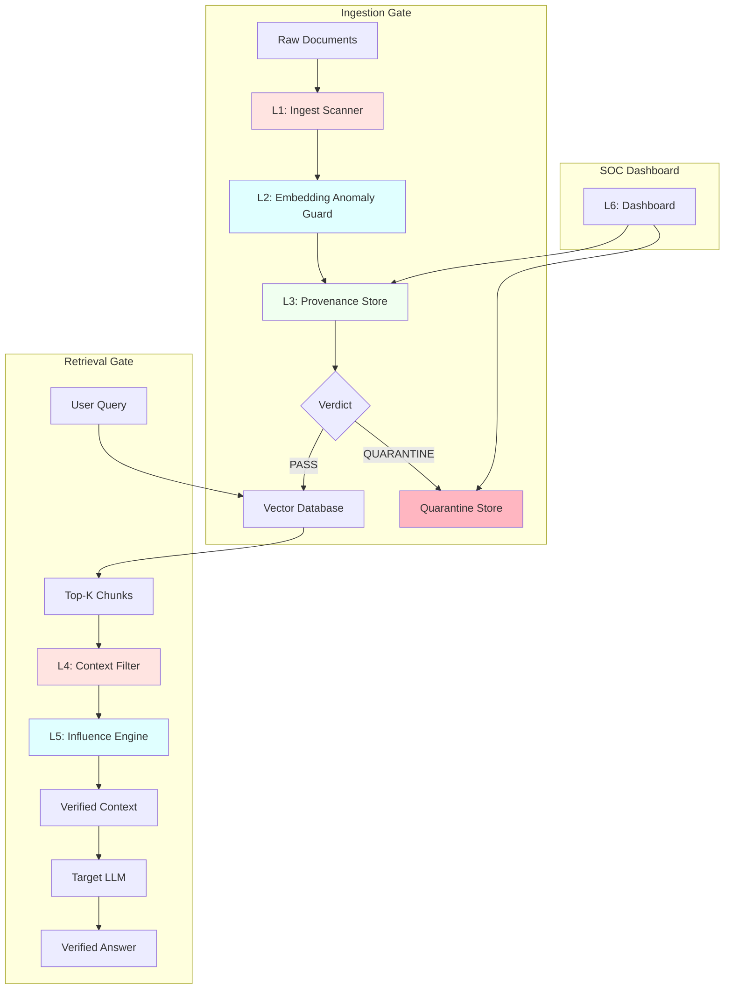

<p align="center">
  
  
  
  
  
  
  
</p>

<h1 align="center">🛡️ Retrivance</h1>

<p align="center">
  <strong>Dual-gate defense for Retrieval-Augmented Generation (RAG) pipelines</strong>
</p>

<p align="center">
  <em>Retrivance screens documents before they are indexed and screens chunks again before they reach the model, treating all retrieved text as untrusted data.</em>
</p>

---

## 📋 Table of Contents

- [Overview](#-overview)
- [Architecture](#-architecture)
- [Detection Layers](#-detection-layers)
- [Evaluation](#-evaluation)
- [Limitations](#-limitations)
- [Roadmap](#-roadmap)
- [Installation](#-installation)
- [Usage](#-usage)
- [Repository Layout](#-repository-layout)
- [Stack](#-stack)
- [Design Principles](#-design-principles)
- [MITRE ATLAS Alignment](#-mitre-atlas-alignment)
- [References](#-references)
- [License](#-license)

---

## Overview

A RAG system trusts whatever its knowledge base returns. A single planted document can steer an answer, smuggle instructions into the prompt, or carry an exfiltration payload, and the result looks like ordinary retrieval.

Retrivance places two gates around the vector store:

- **Ingestion gate:** lexical scan, embedding anomaly check and provenance recording run on every document before it is embedded. Failing documents go to quarantine instead of the index.
- **Retrieval gate:** retrieved top-k chunks are re-screened and tested for outsized influence on the generated answer before the context is released to the LLM.

No single detector is treated as sufficient. Each layer produces a signal, and the verdict combines them.

---

## Architecture



---

## Detection Layers

### 🔍 L1. Ingest Scanner (`core/scanner.py`)

Cheap lexical checks that run on every document.

- Zero-width and invisible characters, after Unicode normalization
- Homoglyphs and mixed-script tokens
- Hidden HTML/CSS: `display:none`, `visibility:hidden`, font-size manipulation
- Imperative injection phrasing (for example "ignore previous instructions", "act as")
- Exfiltration markers: canary tokens, webhook URLs, OAST-style callbacks

### 🧠 L2. Embedding Anomaly Guard (`core/embedding_guard.py`)

Embeds chunks with `sentence-transformers/all-MiniLM-L6-v2` and looks for retrieval bait.

- Nearest-neighbor density: how many probe queries (`configs/probe_queries.json`) return the chunk in their top-k
- Hubness score: chunks that sit close to an unusually large part of the query space
- Reference-corpus comparison, so a single unusual document is not flagged in isolation

### 🔐 L3. Provenance Store (`core/provenance.py`)

SQLite ledger recording the identity and integrity state of each document.

- SHA-256 content hash, author and source attribution
- Mutability lock and revocation status
- Optional Ed25519 signatures

Detects content that changed after ingestion or arrived from an unverified source.

### 🛡️ L4. Context Filter (`core/filter.py`)

Runs at query time on the retrieved chunks.

- Token-level injection scan
- Canary and exfiltration payload check
- TF-IDF + LogisticRegression classifier score
- Quarantine of flagged chunks

### ⚖️ L5. Counterfactual Influence Engine (`core/influence.py`)

Measures how much each chunk moves the answer.

```
baseline        = LLM(Q, chunks)
counterfactual  = LLM(Q, chunks \ {i})        for each chunk i
divergence_i    = 1 - cos_sim(embed(baseline), embed(counterfactual_i))
```

A chunk with high divergence is treated as disproportionately influential, even if it passed every lexical check. The last remaining chunk is never dropped. Cost is K+1 LLM calls per query.

### 📊 L6. Dashboard (`ui/dashboard.py`)

Streamlit interface for ingest audit trails, query monitoring, quarantine approve/reject, provenance verification and per-document risk scores.

---

## Evaluation

### Benchmark design

- **Template-disjoint split:** attack templates in the test set are absent from training
- **Hard negatives:** clean data includes code documentation, HTML and legitimate URLs
- **Adversarial variants:** paraphrased injections, split payloads, homoglyphs, low-confidence attacks

### Results

| Split | Samples | Recall | Precision | ASR | FPR | Clean retention |
|-------|---------|--------|-----------|-----|-----|-----------------|
| Test, unseen templates | 100 | 31.00% | 100% | 69.00% | 0% | n/a |
| Adversarial, bypass | 12 | 8.33% | 100% | 91.67% | 0% | n/a |
| Clean, hard negatives | 150 | n/a | n/a | n/a | 6.67% | 93.33% |
| Overall | 262 | 28.57% | 76.19% | 71.43% | 6.67% | 93.33% |

Per-split precision is 100% because those splits contain no clean samples. The overall precision of 76.19% reflects the 10 false positives from the clean split (32 true positives, 10 false positives).

ASR is the share of attacks that bypassed the defense. FPR is the share of clean documents incorrectly flagged.

### Reading the results

The system is conservative: when it flags something it is usually right, and it keeps 93.33% of hard-negative clean documents. Coverage is the weakness. It misses roughly 69% of unseen-template attacks and 92% of adversarial bypass attempts. Recall, not precision, is the figure to track from here.

---

## Limitations

- Recall is low on unseen and adversarial attacks (28.57% overall, 8.33% on bypass).
- The adversarial split has only 12 samples; its numbers indicate direction, not a robust estimate.
- The benchmark is synthetic: generated poisoned chunks over Wikipedia snippets, not production data.
- No format-level parsing: white-on-white text in PDFs and hidden DOCX metadata are not detected.
- No image or OCR scanning.
- The TF-IDF + LogisticRegression classifier may still overfit to template phrasing despite template-disjoint splits.
- The influence engine adds K+1 LLM calls per query.
- No online adaptation to new attack patterns.

High precision on this benchmark does not imply high attack coverage.

---

## Roadmap

- Larger, more varied attack set, including LLM-generated paraphrases and multilingual injections
- Transformer-based classifier (for example DeBERTa-small) alongside or replacing TF-IDF + LR
- Stronger Unicode normalization and invisible-character handling in L1
- Document parsers for PDF, DOCX and HTML hidden-text extraction; OCR for images
- Threshold calibration on development data only, with precision/recall curves across thresholds
- Direct embedding-space attack tests against L2
- Influence engine caching and early exit to cut latency
- Signed, hash-chained audit logs
- Automated red-team regression tests in CI
- Latency and throughput measurements per layer

---

## Installation

Requires Python 3.10 or 3.11.

```bash
git clone https://github.com/Pragati1466/Retrivance.git
cd Retrivance
pip install -e .
```

---

## Usage

```bash
# Build the benchmark (template-disjoint splits)
python scripts/generate_poison_dataset.py

# Train the classifier on the training split
python scripts/train_classifier.py

# Evaluate on test, adversarial and clean splits
python scripts/run_benchmark.py

# Start the API (docs at http://localhost:8000/docs)
uvicorn ragsentinel.api.server:app --host 0.0.0.0 --port 8000 --reload

# Start the dashboard (http://localhost:8501)
streamlit run ragsentinel/ui/dashboard.py --server.port 8501
```

Benchmark files: `test_poisoned.jsonl` (unseen templates), `adversarial_attacks.jsonl` (bypass), `clean_hard_negatives.jsonl` (hard negatives), all under `data/benchmark/`.

---

## Repository Layout

```
configs/
  sentinel_config.yaml        security configuration
  probe_queries.json          probe queries for the embedding guard
data/
  benchmark/                  train, test, adversarial and clean splits
  ledger/                     SQLite provenance DB, Chroma store
models/
  injection_clf.pkl           trained classifier
ragsentinel/
  api/server.py               FastAPI gateway
  core/                       scanner, embedding_guard, provenance,
                              filter, influence, quarantine
  models/schemas.py           Pydantic schemas
  pipeline/sentinel_rag.py    orchestration
  ui/dashboard.py             Streamlit dashboard
scripts/                      dataset generation, training, benchmark
tests/                        scanner, embedding guard, influence
```

---

## Stack

Python, sentence-transformers (`all-MiniLM-L6-v2`), scikit-learn (TF-IDF, LogisticRegression), ChromaDB, SQLite, FastAPI and Uvicorn, Streamlit. Integrity uses SHA-256 with optional Ed25519.

---

## Design Principles

- Retrieved content is data, never instructions.
- Verify provenance and integrity before content reaches generation.
- Layer independent detectors; none is sufficient alone.
- Evaluate against crafted attacks, not only standard test examples.
- Report false positives; a defense that drops legitimate knowledge is not deployable.


| ATLAS Technique | Retrivance Defense |
|----------------|-------------------|
| RAG Poisoning | Ingest scanner + embedding anomaly guard |
| False RAG Entry Injection | Provenance validation + integrity checks |
| Retrieval Content Crafting | Semantic similarity + hubness detection |
| LLM Prompt Injection (via documents) | Lexical scanner + classification |
| RAG Credential Harvesting | Exfiltration pattern detection |
| LLM Data Leakage | Retrieval-time filtering + quarantine |
| LLM Prompt Obfuscation | Zero-width char detection + homoglyph analysis |
| Triggers in Multimodal Inputs | Hidden text detection (HTML/CSS) |

---

## References

- Lewis et al., Retrieval-Augmented Generation for Knowledge-Intensive NLP Tasks, NeurIPS 2020
- Zou et al., PoisonedRAG: Knowledge Corruption Attacks to Retrieval-Augmented Generation of Large Language Models, 2024
- Xue et al., BadRAG: Identifying Vulnerabilities in Retrieval Augmented Generation of Large Language Models, 2024
- Reimers and Gurevych, Sentence-BERT: Sentence Embeddings using Siamese BERT-Networks
- OWASP, Retrieval-Augmented Generation (RAG) Security Cheat Sheet
- OWASP, LLM Prompt Injection Prevention Cheat Sheet

---

## License

Apache-2.0
